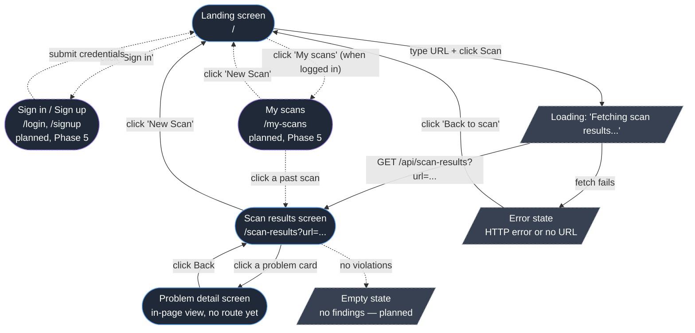
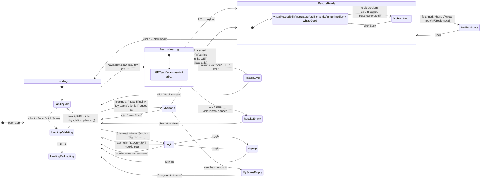
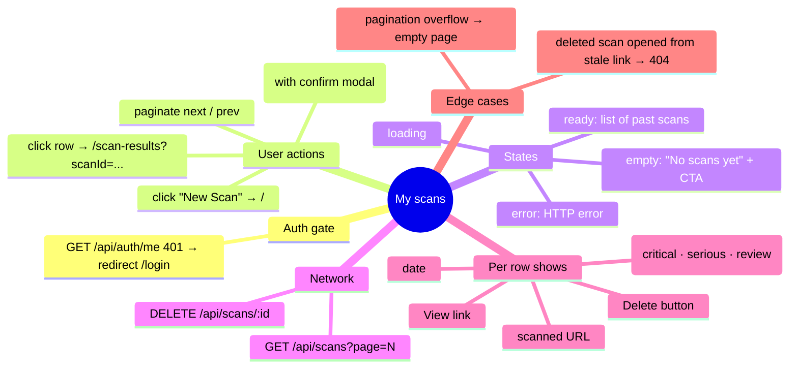
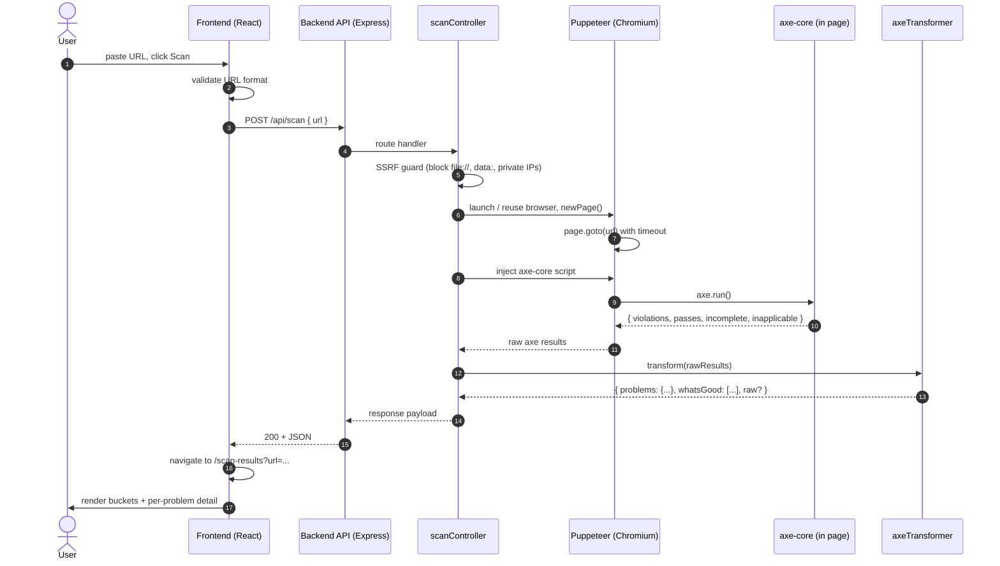
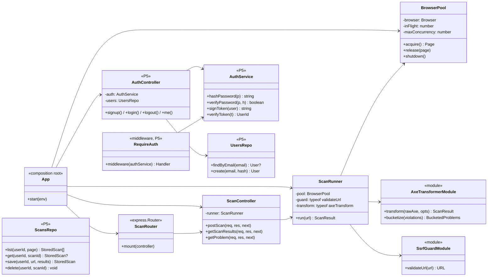

# vizably — Architecture & UX Map

**Status:** Living document
**Companion to:** [`project-roadmap.md`](project-roadmap.md),
[`axecore-integration-roadmap.md`](axecore-integration-roadmap.md)

This document is the visual map of the product. It answers three
questions in order:

1. **What screens exist and what does each one do?** (UX/UI + behavior)
2. **What does the backend do for each screen?** (endpoints, data)
3. **How is the code organized so the two sides talk cleanly?**

Where a feature is not built yet it is marked **[planned]** so the
current state stays honest.

> **2026-06 update — design-system frontend.** The frontend described
> in the screen sections below predates the design-system UI that now
> ships. The planning content (mindmaps, per-screen possibilities,
> backend architecture in §6) is still valid, but route names and
> frontend files have moved:
>
> | This document says | The app today |
> |---|---|
> | `/scan-results?url=…` | `/results?url=…` (`views/ResultsView.jsx`) |
> | `/problems/:id` | `/problem/:id` (`views/ProblemView.jsx`) |
> | `/login`, `/signup` [planned] | `/signin` + `/connect` — shipped as a placeholder flow (`views/SignInView.jsx`, `ConnectView.jsx`) |
> | `/my-scans` [planned] | `/dashboard` — shipped as a placeholder (`views/DashboardView.jsx`) |
> | `pages/` + `components/` | `design-system/` (UI kit) + `views/` (one per screen) |
> | mock scan data | live Puppeteer + axe-core scans via `lib/scanAdapter.js` |
>
> New routes not anticipated here: `/story`, `/donate`, `/account`,
> `/privacy`, `/terms`, and a 404 view. §4.1 below reflects the
> current layout.

---

## 1. Screen mindmap

The whole product is three screens, plus error/loading states. Lines
show navigation; round nodes are screens, square nodes are user
actions.



Solid borders = built today. Dashed purple = planned (Phase 5,
accounts & scan history).

---

## 1.5 Screen flow & content map

§1 above answers "what screens exist". This section answers the two
follow-up questions:

1. **How does the user move between them?** — what triggers each
   transition, and what state/params get carried across.
2. **What does each screen contain?** — a region-by-region inventory
   that doubles as a wireframe checklist and tells you exactly which
   piece of backend data feeds which piece of UI.

Cross-references to phases point at
[`project-roadmap.md`](project-roadmap.md). Today vs target is marked
the same way as elsewhere in this doc: **[planned]** = not built yet,
solid = shipped.

### 1.5.1 Transition diagram

This is more granular than the §1 mindmap: every arrow is labeled
with **trigger → carried state**, and loading/error/empty states are
first-class nodes (not footnotes). Solid = built; dashed purple =
planned.



**State that gets carried across transitions** (the contract every
navigation has to honor):

| From → To                        | Carried in                       | Notes                                                                |
| -------------------------------- | -------------------------------- | -------------------------------------------------------------------- |
| Landing → Results                | `?url=<encoded>` query param     | Single source of truth for which URL was scanned.                    |
| Results → Problem detail (today) | `selectedProblem` React state    | Lives in `ScanResults.jsx`; lost on refresh.                         |
| Results → Problem route [planned] | `:id` path param                 | Survives refresh; needs router (Phase 3 decision).                   |
| My scans → Results [planned]     | `?scanId=<id>` (or `/scans/:id`) | Backend serves stored payload instead of running axe.                |
| Login/Signup → anywhere [planned] | httpOnly JWT cookie + `/auth/me` | Frontend never sees the token; gate "My scans" link on `/auth/me`.   |

### 1.5.2 Per-screen content inventory

Each screen is broken into UI regions. For every region: what it
shows, what data it needs, and where that data comes from. Use this
as a wireframe checklist when you start a screen — if a region has no
data source listed, that's a backend gap, not a frontend one.

#### Landing — `/`  (Phase 0/3)

| Region            | Contents                                                | Data source                                  |
| ----------------- | ------------------------------------------------------- | -------------------------------------------- |
| Header            | "vizably" wordmark, one-line subtitle                 | static                                       |
| Auth slot [planned, P5] | "Sign in" link, **or** "My scans · Log out" if authed | `GET /api/auth/me`                          |
| URL form          | `<input type="url">`, "Scan" button (disabled empty / `aria-busy` while scanning) | local state |
| Validation slot   | inline error ("That doesn't look like a URL") **[planned, replaces `alert`]** | client-side `new URL(...)` |
| SR-only hint      | screen-reader-only instructions                         | static                                       |
| Footer [planned]  | links to docs / GitHub                                  | static                                       |

#### Scan results — `/scan-results?url=...`  (Phase 1/2/3)

| Region             | Contents                                                                                  | Data source                                                                                       |
| ------------------ | ----------------------------------------------------------------------------------------- | ------------------------------------------------------------------------------------------------- |
| Header             | "Scan Results for `<url>`", "← New Scan" link                                             | `?url=` from query string                                                                         |
| Loading state      | "Fetching scan results…" spinner                                                          | render while `fetch` pending                                                                      |
| Error state        | message + "Back to scan" button                                                           | thrown from `fetch` / missing `?url=`                                                             |
| Problems — bucket grid | three cards-of-cards: `visualAccessibility`, `structureAndSemantics`, `multimedia`    | `GET /api/scan-results?url=...` → `problems.<bucket>` (today: mock; target: axe-driven)           |
| Needs review bucket [planned, P3] | fourth bucket from axe `incomplete`                                            | same response, new key (depends on Option A/B/C)                                                  |
| Severity badges [planned, P3] | "critical / serious / moderate / minor" chips on each card                       | axe `impact` per violation                                                                        |
| WCAG tag filters [planned, P3] | toggleable chips ("wcag2a", "wcag21aa", …)                                      | axe `tags`                                                                                        |
| What's Good        | list of passing checks                                                                    | response `whatsGood[]`                                                                            |
| Empty state [planned] | "No issues found 🎉" + "Scan another"                                                  | response with zero violations                                                                     |

#### Problem detail — in-page today, `/problems/:id` later  (Phase 2/3)

| Region              | Contents                                          | Data source                                                                |
| ------------------- | ------------------------------------------------- | -------------------------------------------------------------------------- |
| Title               | axe `help` (one-line summary)                     | violation object                                                           |
| Severity badge [planned] | colored chip                                  | axe `impact`                                                               |
| Description         | axe `description` (body copy)                     | violation object                                                           |
| WCAG tag chips [planned] | small chips                                  | axe `tags`                                                                 |
| "Learn more" link [planned] | external link to Deque University         | axe `helpUrl`                                                              |
| Offending nodes list [planned] | per node: `html` snippet, `target` selector, `failureSummary` | axe `nodes[]`                                              |
| Back button         | returns to results grid                           | local state today; router `history.back()` later                           |
| Source [planned]    | either embedded in `/api/scan-results` payload **or** fetched via `GET /problems/:id` — open decision | see §4.3 contract table |

#### Sign in / Sign up — `/login`, `/signup`  [planned, Phase 5]

| Region            | Contents                                                  | Data source                                         |
| ----------------- | --------------------------------------------------------- | --------------------------------------------------- |
| Header            | "Sign in" / "Create an account" + toggle link             | static                                              |
| Form              | email, password (signup: confirm), submit                 | local state                                         |
| Inline errors     | "Email already in use", "Wrong password", etc.            | response from `POST /api/auth/{login,signup}`       |
| "Continue without account" | link back to `/`                                 | static                                              |
| Auth side-effect  | sets httpOnly JWT cookie on success                       | server `Set-Cookie` header                          |

#### My scans — `/my-scans`  [planned, Phase 5]

| Region              | Contents                                                                            | Data source                                              |
| ------------------- | ----------------------------------------------------------------------------------- | -------------------------------------------------------- |
| Header              | "My scans", "New Scan" button, account menu (Log out)                               | `GET /api/auth/me`                                       |
| Scan list / table   | per row: scanned URL, date, headline counts ("3 critical · 7 serious · 12 review"), "View", "Delete" | `GET /api/scans?page=N`                            |
| Pagination          | next / prev (or infinite scroll)                                                    | response `pageInfo`                                      |
| Per-row delete confirm | modal "Delete this scan?"                                                        | `DELETE /api/scans/:id`                                  |
| Empty state         | "No scans yet" + CTA to `/`                                                         | empty list response                                      |
| Auth gate           | redirects to `/login` if `/auth/me` returns 401                                     | `GET /api/auth/me`                                       |

### 1.5.3 Phase mapping

A quick cross-reference so it's obvious which screen lights up in
which phase of [`project-roadmap.md`](project-roadmap.md):

| Screen / transition                            | Lands in phase                                                                                       |
| ---------------------------------------------- | ---------------------------------------------------------------------------------------------------- |
| Landing form, redirect to results              | already shipped (Phase 0)                                                                            |
| Real `POST /api/scan` from landing             | [Phase 2 — real scanner](project-roadmap.md#phase-2--real-scanner-axe--puppeteer)                    |
| Bucketed results render                        | already shipped against mock; promoted to real data in Phase 2                                       |
| Severity badges, WCAG filters, "Needs review" bucket, real router, problem route | [Phase 3 — UX](project-roadmap.md#phase-3--ux--ui-on-real-data) |
| Loading / error / empty polish                 | [Phase 3](project-roadmap.md#phase-3--ux--ui-on-real-data) + [Phase 4 — reliability](project-roadmap.md#phase-4--reliability--ops) |
| Sign in / Sign up, My scans, auth gating, scan history | [Phase 5 — accounts & scan history](project-roadmap.md#phase-5--accounts--scan-history)      |

### 1.6 Per-screen possibility mindmaps

§1.5.1 covers transitions **between** screens. This section is the
exhaustive view **inside** each screen: every user action, every state
the UI can be in, every error/edge case, and every side-effect that
leaves the screen. Use these as the spec when wiring a page up — every
node should map to either a piece of UI, a piece of state, or a code
path. **Solid = built today. Italic + `[Pn]` = planned in Phase n.**

#### Landing — `/`

```mermaid
mindmap
  root((Landing))
    User actions
      paste / type URL
      press Enter
      click "Scan"
      *click "Sign in" [P5]*
      *click "My scans" [P5]*
    States
      idle
        button disabled when input empty
      scanning
        button shows "Redirecting…"
        button aria-busy=true
        input disabled
      *authed [P5]*
        *header shows "My scans · Log out"*
    Validation
      empty trim → no-op
      invalid URL → window.alert (today)
      *inline error [P3]*
    Side effects
      setTimeout 1200ms (P1 intern: name the constant)
      window.location.href = /scan-results?url=...
      *POST /api/scan { url } [P2]*
      *GET /api/auth/me on mount [P5]*
    Carries forward
      ?url=<encoded> in query string
```

#### Scan results — `/scan-results?url=...`

```mermaid
mindmap
  root((Scan results))
    Inputs
      ?url= from query string
    Network
      GET /api/scan-results?url=...
      *GET /api/scans/:id [P5, history]*
    States
      loading: "Fetching scan results..."
      ready: three buckets + What's Good
      error: HTTP error or missing ?url=
      *empty: zero violations [P3]*
    User actions
      click problem card → in-page detail
      click "← New Scan" → /
      *click "Learn more" → axe helpUrl [P3]*
      *click WCAG tag chip → filter [P3]*
      *click severity badge → filter [P3]*
      *click "View saved scan" [P5]*
    Edge cases
      results.problems.<bucket> missing → "No issues in this category"
      results.whatsGood missing → "No positives found"
      *axe incomplete bucket [P3]*
      *backend timeout / DNS failure category [P4]*
    Side effects
      sets selectedProblem (lost on refresh today)
      *navigates to /problems/:id [P3]*
      *navigates to /scan-results?scanId=... [P5]*
```

#### Problem detail — in-page today, `/problems/:id` later

```mermaid
mindmap
  root((Problem detail))
    Inputs
      problem prop (today, from ScanResults state)
      *:id path param [P3]*
    What it shows
      name (axe `help`)
      category
      rootCause (axe `description`)
      codeSnippet (one example today; *all axe `nodes[]` [P2]*)
      solution steps
      *severity badge (axe `impact`) [P3]*
      *WCAG tag chips (axe `tags`) [P3]*
      *"Learn more" → axe `helpUrl` [P3]*
      *list of offending nodes: html + selector + failureSummary [P2]*
    User actions
      click "← Back to results"
      *copy CSS selector [P3]*
      *open helpUrl in new tab [P3]*
    Edge cases
      problem prop missing → renders null
      *unknown :id (deep link) → 404 page [P3]*
    Side effects
      none today (pure render)
      *history.back() / router nav [P3]*
```

#### Sign in / Sign up — `/login`, `/signup` *[P5]*

```mermaid
mindmap
  root((Auth))
    User actions
      submit email + password
      toggle sign in ↔ sign up
      click "continue without account" → /
    States
      idle
      submitting
      success → redirect to /
      error: inline message
    Validation
      email format
      password length
      signup: confirm password matches
    Network
      POST /api/auth/login
      POST /api/auth/signup
    Side effects
      Set-Cookie (httpOnly JWT) on success
      AuthContext refetches /api/auth/me
    Edge cases
      already-logged-in user lands here → redirect to /
      rate-limited → friendly inline error
```

#### My scans — `/my-scans` *[P5]*



---

## 2. Per-screen breakdown

Each screen below has the same four sections so it's easy to scan:
**Purpose**, **UI elements**, **What the user can do**, **What the
backend does**.

### 2.1 Landing screen — `/`

**File:** `frontend/src/pages/LandingPage.jsx`
**Helpers:** `frontend/src/utils/urlValidator.js` (pure URL check),
`frontend/src/lib/apiClient.js` (the only file that calls `fetch`).

**Purpose.** Single entry point. Get a URL from the user and send them
to a results page for it.

**UI elements.**
- App title (`vizably`) + one-line subtitle.
- Single text input (`type="url"`, labeled for screen readers).
- "Scan" button (disabled while empty or while a scan is in flight,
  `aria-busy` while scanning).
- Inline `role="alert"` validation message (replaced the old
  `window.alert`).
- Hidden hint text exposed to screen readers.

**What the user can do.**
- Type a URL and press Enter or click Scan.
- See an inline client-side URL validation error.

**What happens on submit (current).**
1. `urlValidator.isValidUrl(url)` validates the format client-side.
2. State flips to `scanning`; button shows "Redirecting…".
3. `useNavigate()` pushes `/scan-results?url=<encoded>` — no full page
   reload. The actual scan request is fired by the next screen, not
   here.

**What happens on submit (target — Phase 2).**
1. Validate URL.
2. `POST /api/scan { url }` to kick off the scan.
3. On success, `useNavigate()` to `/scan-results?url=...` carrying
   either the results or a job id.
4. Show real loading/progress while the scan runs.

**What the backend does today.** Nothing. The submit on this screen is
purely a client-side route change.

---

### 2.2 Scan results screen — `/scan-results?url=...`

**File:** `frontend/src/pages/ScanResultsPage.jsx`
**Sub-components:** `frontend/src/components/ProblemCategoryBox.jsx`,
`frontend/src/components/WhatsGood.jsx`,
`frontend/src/components/ProblemSolutionPage.jsx`
**Hook:** `frontend/src/hooks/useScan.js` (owns the
`{ data, loading, error }` state machine)

**Purpose.** Show what the scanner found for the URL in the query
string, grouped so a non-technical user can understand it.

**UI elements.**
- Header: "Scan Results for `<url>`" + "← New Scan" link.
- "Problems" section — three buckets (current shape):
  `visualAccessibility`, `structureAndSemantics`, `multimedia`.
- "What's Good" section — what the page got right.
- Each problem renders as a card the user can click.
- Loading and error states render in place of the grid.
- **Planned (Phase 3):** a fourth bucket "Needs manual review" backed
  by axe's `incomplete` array; severity badges driven by axe `impact`;
  WCAG tag filters.

**What the user can do.**
- Read the buckets.
- Click any problem card → in-page detail view (see 2.3).
- Click "← New Scan" → back to landing.

**What happens on load (current).**
1. `useSearchParams()` reads `?url=` from the query string.
2. `useScan(url)` validates it (missing → error state) and calls
   `apiClient.getScanResults(url)`.
3. The hook returns `{ data, loading, error }`; the page renders the
   matching state.
4. Backend ignores the URL today and returns the same mock object
   regardless (until Phase 2 lands the real scanner).

**What happens on load (target — Phase 2).**
1. Same kickoff, but the backend really runs Puppeteer + axe-core for
   that URL and returns either:
   - the bucketed shape (Option B), **or**
   - bucketed summary + `raw` axe arrays (Option C).
   Decision tracked in
   [`project-roadmap.md`](project-roadmap.md#still-open).
2. Render violations sorted by `impact`.
3. Render an "incomplete" bucket if non-empty.

**What the backend does.**
- **Today:** `GET /api/scan-results?url=...` is served by
  `routes/scan.js` → `ScanController.getScanResults` → returns
  `backend/data/mockScanResults.js` verbatim. The SSRF guard rejects
  bad URLs before the controller hits the fixture.
- **Target:** same route/controller, but the controller delegates to
  `ScanRunner` → Puppeteer (`page.goto(url)`) → inject axe-core →
  `axe.run()` → `axeTransformer` → JSON.

---

### 2.3 Problem detail screen — `/problems/:id`

**File (page):** `frontend/src/pages/ProblemPage.jsx`
**Component (in-results inline detail):**
`frontend/src/components/ProblemSolutionPage.jsx`
**Hook:** `frontend/src/hooks/useProblem.js`
**Routing:** real route (`/problems/:id`) shipped in PR #40, so the
detail view is now refresh-safe and shareable. The in-page click on a
results card still uses local state for the side-by-side view.

**Purpose.** Show one problem in depth: what it is, why it matters,
how to fix it, and where it appears on the page that was scanned.

**UI elements (today, mock-driven).** Title, description, fix
suggestion(s), back button.

**UI elements (target — Phase 2/3, axe-driven).**
- `help` as headline.
- `impact` as a colored badge.
- `description` as the body.
- A "Learn more" link to `helpUrl` (Deque University remediation
  guidance — this is "the recommendation").
- WCAG `tags` as small chips.
- A list of offending nodes: `html` snippet + `target` selector +
  `failureSummary` per node.

**What the user can do.** Read it; click "Back" to return to the
results grid; **planned:** click the "Learn more" link; **planned:**
copy a selector.

**What the backend does.** Either:
- `GET /problems/:id` returns one problem (current; mock).
- Or the problem object is already inside the results payload and the
  frontend doesn't refetch (likely the right call once the response
  shape is finalized).

---

### 2.4 Sign in / Sign up — `/login`, `/signup` [planned, Phase 5]

**File (target):** `frontend/src/pages/Login.jsx`,
`frontend/src/pages/Signup.jsx`.

**Purpose.** Let a returning user identify themselves so the backend
can attach scans to their account and show their history.

**UI elements.** Email + password fields, submit button, link to
toggle between sign in and sign up, inline validation errors, a
"continue without an account" link back to `/`.

**What the user can do.**
- Sign up with email + password.
- Log in with the same.
- Log out (from the header on any screen once authenticated).

**What the backend does.**
- `POST /api/auth/signup { email, password }` → create user, set
  httpOnly JWT cookie.
- `POST /api/auth/login { email, password }` → verify, set cookie.
- `POST /api/auth/logout` → clear cookie.
- `GET /api/auth/me` → return the current user (or 401), used by the
  frontend on every page load to know whether to show "My scans".

**Whether we build it ourselves vs use a managed provider** is an
open decision in
[`project-roadmap.md`](project-roadmap.md#phase-5--accounts--scan-history).

---

### 2.5 My scans — `/my-scans` [planned, Phase 5]

**File (target):** `frontend/src/pages/MyScans.jsx`.

**Purpose.** A returning user's home base — every scan they have run,
newest first, click to re-open.

**UI elements.**
- Header: "My scans" + "New Scan" button.
- A list (or table) of past scans, each row showing: scanned URL,
  date, headline counts (e.g. "3 critical · 7 serious · 12 needs
  review"), and a "View" link.
- Pagination or infinite scroll once the list grows.
- Per-row "Delete" action with a confirm.
- Empty state when the user has no scans yet — links back to `/`.

**What the user can do.**
- Click a row → land on the same `/scan-results?...` screen, but the
  results come from the database instead of a fresh scan.
- Delete a scan.
- Start a new scan from the header.

**What the backend does.**
- `GET /api/scans?page=N` → paginated list of the current user's
  scans (auth-required).
- `GET /api/scans/:id` → one scan (auth-required, 404 if it isn't
  yours).
- `DELETE /api/scans/:id` → remove it.
- When the results screen is opened from a saved scan, it can fetch
  by id instead of re-running axe — same render path, different data
  source.

---

## 3. End-to-end scan sequence (target state)

This is what we're building toward. Today the scanner box is replaced
with "return mock" — everything else is the same.



---

## 4. Code organization

The split is simple: **frontend is dumb about scanning, backend is
dumb about presentation.** The wire format between them is the only
contract that matters.

### 4.1 Frontend (`frontend/`)

```
frontend/src/
├── main.jsx                       # React bootstrap (loads fonts + theme CSS)
├── App.jsx                        # BrowserRouter, routes, theme + auth state
├── design-system/                 # Reusable UI kit (token-driven)
│   ├── Logo / Badge / Button / Card / Input
│   └── CodeBlock / ProblemRow / ScoreDial / SeverityBadge
├── views/                         # One component per screen
│   ├── AppShell.jsx               # Header + footer chrome
│   ├── LandingView.jsx            # Screen 2.1 (scan entry)
│   ├── ResultsView.jsx            # Screen 2.2 (/results?url=…)
│   ├── ProblemView.jsx            # Screen 2.3 (/problem/:id)
│   ├── SignInView / ConnectView   # Screen 2.4 (placeholder flow)
│   ├── DashboardView.jsx          # Screen 2.5 (placeholder)
│   └── Story / Donate / Account / Legal / NotFound views
├── hooks/
│   └── useScan.js                 # { data, loading, error } for deep links
├── lib/
│   ├── apiClient.js               # the only file that imports `fetch`
│   ├── scanAdapter.js             # ScanResult → report view model
│   └── icons.jsx                  # lucide wrapper + brand marks
├── utils/
│   └── urlValidator.js            # isValidUrl + normalizeUrl
├── data/
│   └── placeholders.js            # auth/storage placeholder data
├── styles/
│   ├── theme.css                  # design tokens, light/dark, base layer
│   └── fonts.css                  # self-hosted webfonts
├── assets/fonts/                  # woff2 files
└── __tests__/                     # Vitest + React Testing Library
```

**Responsibilities.**
- Validate input (URL format) before calling the API.
- Talk to the backend through `/api/*` (Vite proxies these to
  `localhost:3000` in dev).
- Own all rendering, sorting, filtering, and bucket grouping if we go
  with Option A (raw axe arrays). If we keep Option B/C, the frontend
  just renders what the backend hands it.
- Own all navigation between screens.

**What the frontend never does.**
- It never imports Puppeteer or axe-core.
- It never makes outbound calls to a scanned site directly (that's the
  backend's job — and a CORS/SSRF problem if it tried).

### 4.2 Backend (`backend/`)

```
backend/
├── index.js                       # bootstrap: load .env, listen
├── app.js                         # composition root (DI wiring)
├── routes/
│   ├── index.js                   # mounts /api and /problems
│   ├── scan.js                    # /api/scan, /api/scan-results
│   ├── problems.js                # /problems/:id
│   ├── auth.js                    # /api/auth/*  [planned, Phase 5]
│   └── scans.js                   # /api/scans/* (history)  [planned, Phase 5]
├── controllers/
│   ├── scanController.js          # request/response, bound handlers
│   ├── authController.js          # signup/login/logout/me  [planned, Phase 5]
│   └── scansController.js         # list / get / delete saved scans  [planned, Phase 5]
├── services/
│   ├── axeTransformer.js          # axe → API shape, pure function;
│   │                              #   stub today, body in Phase 2
│   ├── ssrfGuard.js               # URL allow/deny, pure function
│   ├── scanRunner.js              # Puppeteer driver  [planned, Phase 2]
│   └── authService.js             # password hashing, JWT sign/verify
│                                  #   [planned, Phase 5]
├── middleware/
│   └── requireAuth.js             # gate protected routes  [planned, Phase 5]
├── db/                            # [planned, Phase 5]
│   ├── client.js                  # pg pool / Prisma client
│   ├── migrations/                # users, scans schema
│   └── repositories/
│       ├── usersRepo.js
│       └── scansRepo.js
├── data/
│   └── mockScanResults.js         # Phase-1 fixture (also used in tests)
├── tests/                         # node:test + supertest
│   ├── health.test.js
│   ├── scan.test.js
│   ├── ssrfGuard.test.js
│   └── axeTransformer.test.js
├── Dockerfile                     # node:22-alpine
├── README.md                      # run / test / env tables
└── .env.example                   # PORT, FRONTEND_ORIGIN
                                   #   (JWT_SECRET, DATABASE_URL: P5)
```

**Layered responsibilities.**

| Layer        | Knows about           | Doesn't know about       |
| ------------ | --------------------- | ------------------------ |
| `routes/`    | Express, URL paths    | Puppeteer, axe shape     |
| `controllers/` | HTTP req/res, Puppeteer driver | how axe maps to UI buckets |
| `services/`  | axe input → API output (pure) | Express, Puppeteer       |
| `data/`      | Static fixtures       | Anything else            |

This split is what lets `axeTransformer.js` be unit-tested with a
captured axe payload and no browser — and what lets routes be swapped
or renamed without touching scanning logic.

### 4.3 The contract between them

For each screen, the request → response contract is:

| Screen       | Request                                | Response (target)                           |
| ------------ | -------------------------------------- | ------------------------------------------- |
| Landing      | `POST /api/scan { url }`               | full results JSON (sync) **or** `{ jobId }` |
| Scan results | `GET /api/scan-results?url=<encoded>`  | full results JSON                           |
| Problem      | (in-payload) **or** `GET /problems/:id` | one problem object                         |

The exact JSON shape depends on the open "Scan API shape" decision in
[`project-roadmap.md`](project-roadmap.md#still-open).
Whichever option wins, the per-violation fields we surface to the UI
are fixed by axe-core itself: `id`, `help`, `helpUrl`, `impact`,
`tags`, and `nodes[].{html, target, failureSummary}`. Those are the
"recommendation" data — see
[`project-roadmap.md` § What axe-core actually returns](project-roadmap.md#what-axe-core-actually-returns).

---

## 5. Where to look when X breaks

A quick lookup table for debugging — keep this updated as the codebase
moves.

| Symptom                                                    | Likely file                              |
| ---------------------------------------------------------- | ---------------------------------------- |
| Landing page: clicking Scan does nothing                   | `frontend/src/pages/LandingPage.jsx` (+ `utils/urlValidator.js`) |
| Landing page: navigates but results page is blank/errors   | `frontend/src/hooks/useScan.js` + `lib/apiClient.js` |
| Results page stays on "Fetching scan results..."           | network tab → `/api/scan-results` → `backend/routes/scan.js` → `controllers/scanController.js` |
| Results render but a problem card crashes on click         | `frontend/src/pages/ScanResultsPage.jsx` (`setSelectedProblem`) + `components/ProblemSolutionPage.jsx` |
| `/problems/:id` deep link 404s                             | `frontend/src/pages/ProblemPage.jsx` + `hooks/useProblem.js` (frontend) and `backend/routes/problems.js` (backend) |
| URL form submission rejected with "ssrf"                   | `backend/services/ssrfGuard.js`          |
| CORS error in browser console                              | `backend/app.js` (`cors({ origin: process.env.FRONTEND_ORIGIN })`) and `backend/.env.example` |
| "MODULE_NOT_FOUND" on backend start                        | `backend/package.json` (dep must live there, not at repo root) |
| Scan returns 500 on a real URL                             | `services/scanRunner.js` Puppeteer error handling [planned, Phase 2/4] |
| Same mock returned for every URL                           | expected today — until Phase 2 lands     |

---

## 6. Code architecture — modules, classes, and types

§4 lays out the directory tree. This section answers the next
question: **what should live in those files, and how do the pieces
talk to each other?** The goal is an architecture that scales from
"mock scanner" today to "real scanner + auth + history + queue"
without rewrites — by drawing the layer boundaries cleanly now.

> **Why some things are classes and some aren't.** OOP isn't the
> goal; *clear seams* are. We use classes where there is **identity
> + state** (a Puppeteer browser, a database connection, a request
> handler that needs to be bound). We use **pure modules of
> functions** for stateless transforms (axe → API shape, URL
> validation). The frontend is React, so pages are functional
> components and side-effects live in **hooks**; only the network
> client is a class because it owns a base URL and credentials.

### 6.1 Abstraction strategy at a glance

| Concern                                  | Today                            | Target shape                              |
| ---------------------------------------- | -------------------------------- | ----------------------------------------- |
| Express routing                          | inline in `backend/index.js`     | `routes/*.js` (P1)                        |
| HTTP request/response handling           | inline                           | `controllers/*Controller.js` **classes**, methods bound in constructor (P1) |
| Browser lifecycle                        | n/a (mock)                       | `services/browserPool.js` **class** (P2/P4) |
| Scan orchestration                       | n/a (mock)                       | `services/scanRunner.js` **class** (P2)   |
| axe → API shape                          | n/a (mock returns final shape)   | `services/axeTransformer.js` **pure module** (P1/P2) |
| SSRF / URL allow-list                    | none                             | `services/ssrfGuard.js` **pure module** (P2) |
| Auth                                     | n/a                              | `services/authService.js` **class** (P5)  |
| Database access                          | n/a                              | `db/repositories/*.js` **classes** (P5)   |
| Frontend HTTP                            | inline `fetch` calls             | `lib/apiClient.js` **class** singleton    |
| Frontend page state                      | `useState` per page              | same, plus **hooks** (`useScan`, `useAuth`) |
| Frontend global state (auth)             | none                             | **`AuthContext`** + `useAuth()` hook (P5) |
| Domain shapes                            | implicit                         | **JSDoc `@typedef`** in `shared/types.js` |

### 6.2 Shared domain types

The wire format is the only contract between frontend and backend.
Define it **once**, in a shared file that both sides can `@import`
from JSDoc. No runtime cost; full editor autocomplete; survives the
move to TypeScript later if we want it.

Location: `shared/types.js` at the repo root (shipped in PR #38).
Backend and frontend reference the typedefs via relative
`@typedef {import('../../shared/types.js').…}` JSDoc imports — no
build step, no runtime cost.

```js
// shared/types.js — shipped in PR #38

/**
 * @typedef {'minor'|'moderate'|'serious'|'critical'} Impact
 *
 * @typedef {Object} AxeNode
 * @property {string}   html            Offending HTML snippet.
 * @property {string[]} target          CSS selector(s) (handles iframes / shadow DOM).
 * @property {string}   failureSummary  Pre-formatted "Fix any of the following: …".
 *
 * @typedef {Object} Violation
 * @property {string}     id            axe rule id, e.g. "color-contrast".
 * @property {string}     help          One-line title.
 * @property {string}     helpUrl       Deque University remediation link.
 * @property {Impact}     impact        Drives sort order + badge color.
 * @property {string[]}   tags          e.g. "wcag2a", "wcag21aa", "best-practice".
 * @property {AxeNode[]}  nodes
 * @property {string}    [description]  Body copy for the detail page.
 *
 * @typedef {Violation} IncompleteCheck   // same shape, different bucket
 *
 * @typedef {Object} BucketedProblems
 * @property {Violation[]} visualAccessibility
 * @property {Violation[]} structureAndSemantics
 * @property {Violation[]} multimedia
 *
 * @typedef {Object} ScanResult
 * @property {string}            url        The URL that was scanned.
 * @property {string}            timestamp  ISO 8601.
 * @property {BucketedProblems}  problems
 * @property {string[]}          whatsGood
 * @property {IncompleteCheck[]} [incomplete]   // P3
 * @property {Object}            [raw]          // full axe payload (Option C)
 *
 * @typedef {Object} ScanError
 * @property {'invalid_url'|'ssrf_blocked'|'navigation_timeout'|'http_error'|'internal'} code
 * @property {string} message
 *
 * @typedef {Object} User              // P5
 * @property {string} id
 * @property {string} email
 * @property {string} createdAt
 *
 * @typedef {Object} StoredScan        // P5
 * @property {string}     id
 * @property {string}     userId
 * @property {string}     url
 * @property {string}     createdAt
 * @property {ScanResult} results
 */
```

The exact shape of `ScanResult` is locked by the open "Scan API
shape" decision in
[`project-roadmap.md`](project-roadmap.md#still-open).
Whatever wins, **per-violation fields are fixed by axe** (id, help,
helpUrl, impact, tags, nodes).

### 6.3 Backend class graph



**Rules of thumb:**

- **Routers know URLs and HTTP verbs**; they don't know how axe
  works.
- **Controllers know request/response**; they delegate everything
  else. They are classes so methods can be bound once in the
  constructor — `app.post('/api/scan', ctrl.postScan)` would lose
  `this` otherwise. See [Scanning](https://open.codrlabs.com/vizably/scanning/)
  on Codrlabs Open for the bug pattern.
- **Services are the brain**: `ScanRunner` is the only thing that
  talks to Puppeteer + axe. `AxeTransformer` is a *pure module* —
  it takes a raw axe object in, returns a `ScanResult` out, has no
  side effects, and is unit-testable with a captured fixture.
- **`BrowserPool` owns Chromium's lifecycle**: one browser, many
  pages, capped concurrency. Every other layer borrows pages from
  it and gives them back. Phase 4 reliability work bolts onto this
  class without touching the rest.
- **Repositories own SQL** (P5). Controllers never write SQL;
  services never write SQL. Swapping Postgres for SQLite is a
  one-file change.

### 6.4 Frontend abstractions

React's natural unit is the **functional component + hook**, not
the class. The only class on the frontend is the network client —
it owns a base URL and (P5) credentials, and centralizing it makes
mocking trivial in tests.

```mermaid
classDiagram
    direction LR

    class App {
        <<root component>>
        +render()
    }

    class Router {
        <<react-router, P3>>
    }

    class LandingPage {
        <<page component>>
    }
    class ScanResultsPage {
        <<page component>>
    }
    class ProblemPage {
        <<page component>>
    }
    class LoginPage {
        <<page component, P5>>
    }
    class MyScansPage {
        <<page component, P5>>
    }

    class useScan {
        <<hook>>
        +useScan(url) {data, loading, error}
    }
    class useAuth {
        <<hook, P5>>
        +useAuth() {user, login, logout, signup}
    }
    class useScans {
        <<hook, P5>>
        +useScans(page) {scans, loading, error}
    }

    class ApiClient {
        <<class, singleton>>
        -baseUrl: string
        +runScan(url) ScanResult
        +getScanResults(url) ScanResult
        +getProblem(id) Violation
        +login(email, pw) User       %% P5
        +signup(email, pw) User      %% P5
        +me() User?                  %% P5
        +listScans(page) StoredScan[] %% P5
        +deleteScan(id) void         %% P5
    }

    class ScanValidator {
        <<pure module>>
        +isValidUrl(s) boolean
    }

    class ErrorFormatter {
        <<pure module>>
        +toUserMessage(err) string
    }

    class AuthContext {
        <<context, P5>>
        +Provider
        +useContext()
    }

    App --> Router
    Router --> LandingPage
    Router --> ScanResultsPage
    Router --> ProblemPage
    Router --> LoginPage
    Router --> MyScansPage
    LandingPage --> ScanValidator
    LandingPage --> ApiClient
    ScanResultsPage --> useScan
    useScan --> ApiClient
    useScan --> ErrorFormatter
    LoginPage --> useAuth
    MyScansPage --> useScans
    useAuth --> AuthContext
    useAuth --> ApiClient
    useScans --> ApiClient
    AuthContext --> ApiClient
```

**Rules of thumb:**

- **Pages own layout + which hooks/services they call.** No `fetch`
  inside a page component.
- **Hooks own loading/error/data state machines.** A page that
  uses `useScan(url)` reads a `{ data, loading, error }` triple and
  renders accordingly — same pattern for `useAuth`, `useScans`.
- **`ApiClient` is the only file that imports `fetch`.** Everything
  else imports the singleton instance. Tests substitute a fake
  client at the module level.
- **`AuthContext` is the only place auth state lives.** `useAuth()`
  reads from it; `LoginPage` writes to it after a successful
  `POST /api/auth/login` (which sets the httpOnly cookie — the
  frontend never sees the token itself).
- **Domain types come from `shared/types.js`** via JSDoc imports —
  the frontend doesn't redefine `Violation` / `ScanResult`.

### 6.5 Composition root and test seams

A "composition root" is *the one place* that constructs concrete
classes and wires them together. Everywhere else takes its
dependencies via constructor or function arguments. This is what
makes the layers unit-testable without a DI framework.

**Backend composition root (`backend/app.js`).**

The skeleton is shipped — today it wires the controller against the
mock fixture; the Phase-2 lines below are pseudo-code:

```js
// shipped (PR #38)
const scanController = new ScanController({ mockScanResults, ssrfGuard });
mountRoutes(app, { scanController });

// [planned, P2] — replace mockScanResults with a real runner
const pool       = new BrowserPool({ maxConcurrency: 2 });
const runner     = new ScanRunner({ pool, transform, validateUrl: ssrfGuard.validate });
const scanCtrl   = new ScanController({ runner, ssrfGuard });

// [planned, P5] — auth + history
const authSvc    = new AuthService({ jwtSecret: env.JWT_SECRET });
const usersRepo  = new UsersRepo(db);
const scansRepo  = new ScansRepo(db);
const authCtrl   = new AuthController({ authSvc, usersRepo });
const requireAuth = makeRequireAuth(authSvc);

app.use('/api/auth',  makeAuthRouter(authCtrl));
app.use('/api/scans', requireAuth, makeScansRouter(scanCtrl, scansRepo));
```

**Frontend composition root.**

`frontend/src/main.jsx` mounts `<App/>`; `App.jsx` owns the
`BrowserRouter` + `Routes` (PR #40). The `ApiClient` singleton is
imported from `lib/apiClient.js` directly today — wrapping it in a
context only becomes useful when auth state lands in P5:

```jsx
// shipped (PR #40)
ReactDOM.createRoot(document.getElementById('root')).render(<App />);

// [planned, P5] — providers around the router for auth state
const api = apiClient; // already a singleton
ReactDOM.createRoot(document.getElementById('root')).render(
  <ApiProvider value={api}>
    <AuthProvider api={api}>
      <App />
    </AuthProvider>
  </ApiProvider>
);
```

**Test seams (what you can fake at each layer):**

| Layer under test       | What you fake                                | How                                      |
| ---------------------- | -------------------------------------------- | ---------------------------------------- |
| `AxeTransformer`       | nothing — pure function                      | feed a captured axe payload fixture      |
| `SsrfGuard`            | nothing — pure function                      | string inputs                            |
| `ScanRunner`           | `BrowserPool`, `transform`, `validateUrl`    | constructor injection                    |
| `ScanController`       | `ScanRunner`                                 | constructor injection                    |
| `routes/scan.js`       | `ScanController`                             | supertest + a stub controller            |
| `UsersRepo`            | nothing                                      | spin up a real ephemeral Postgres (or mock pg) |
| `AuthService`          | clock / `jwt`                                | inject a clock; pin a fixed `jwtSecret`  |
| `ApiClient` (frontend) | `fetch`                                      | `vi.spyOn(global, 'fetch')` or MSW       |
| `useScan`              | `ApiClient`                                  | render in a test wrapper with a stub api |
| Page components        | hooks                                        | `vi.mock('../hooks/useScan', …)`         |

### 6.6 Where today's repo sits on this map

**What shipped in Phase 1 + 3 (PRs #38, #40).** The backend now has
the layered structure described above: `routes/` → `controllers/` →
`services/` (`axeTransformer` stub, `ssrfGuard`), with `app.js` as the
composition root. The frontend uses `react-router-dom` v7, with
`pages/` for screens, `hooks/` for state machines (`useScan`,
`useProblem`), `lib/apiClient.js` as the only file that calls `fetch`,
and `utils/urlValidator.js` for client-side URL checks. The
`/problems/:id` route is real and refresh-safe. CORS reads
`FRONTEND_ORIGIN` from `.env`, and tests run via `node:test` +
`supertest` (backend, 17 / 17) and Vitest (frontend, 19 / 19).

For the full before/after detail and the migration mapping, see
[`codebase-reorganization.md`](codebase-reorganization.md).

**What still has to land before §6.3 / §6.4 are fully realized:**

| Slot                                    | Phase | What's missing                                                  |
| --------------------------------------- | ----- | --------------------------------------------------------------- |
| `services/scanRunner.js` + `BrowserPool` | P2   | Real Puppeteer driver replacing the `mockScanResults` injection |
| `services/axeTransformer.js` body       | P2    | Implement the chosen response shape (Option A/B/C)              |
| Loading/error/empty UI on results page  | P3    | Drive from `useScan`'s `{ data, loading, error }` triple        |
| Severity badges / WCAG filters / "Needs review" bucket | P3 | Need real axe data first                                |
| `services/authService.js`, `db/`, repos | P5    | Auth + persistence; `LoginPage`, `MyScansPage`, `useAuth`       |
| `ApiProvider` / `AuthProvider` context  | P5    | Wrap `<App/>` once auth state needs to live above the router    |

Each row is a small, mechanical addition — not a rewrite. That's the
test of whether the architecture in §6 is right: if landing it
requires throwing today's code away, it's wrong.
